# Kelompok 4 (P1) - Node RED
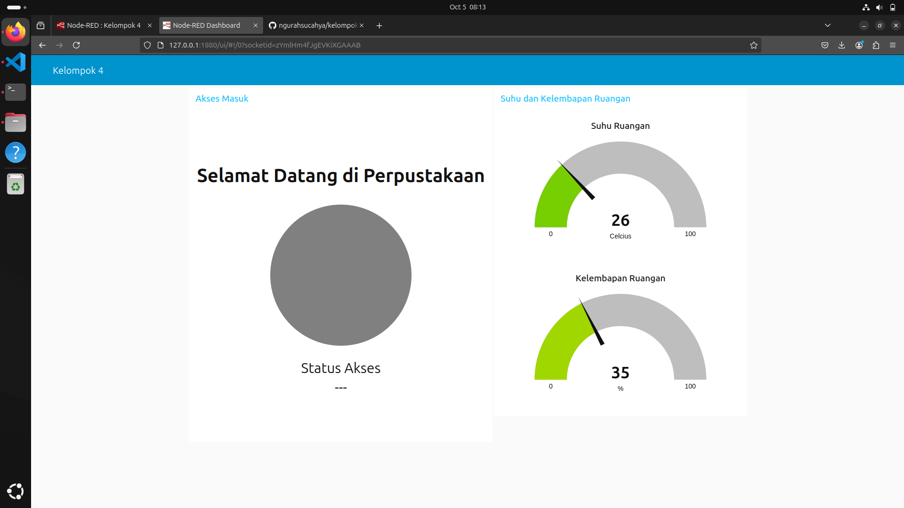
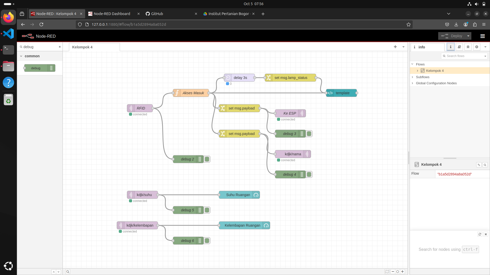

# Anggota Tim
| Nama                                      | NIM          |
|-------------------------------------------|--------------|
| [I Gusti Ngurah Sucahya Satria Adi Pratama](https://github.com/ngurahsucahya)| G6401221031  |
| [Hamdan Arif Darojat](https://github.com/hmdanna)| G6401221063  |
| [Elrica Meriana Isabel Tutu](https://github.com/ElricaMeriana)| X1004241068 |
|                          |  |

# Sekilas Tentang
<details>
   Node-RED adalah alat pemograman untuk menghubungkan perangkat-perangkat keras, API, dan layanan online dengan cara yang baru dan menarik. Node-RED memberikan editor berbasis browser untuk membuat aplikasi Internet of Things (IoT) yang mana lingkungan pemrograman visualnya mempermudah penggunanya untuk membuat aplikasi sebagai “flow”. Flow ini terbentuk dari node-node yang saling berhubungan di mana tiap node melakukan tugas tertentu. Walaupun Node-RED didesain untuk Internet of Things (IoT), ia juga dapat digunakan untuk keperluan umum dan untuk berbagai macam jenis aplikasi. Node-RED menyediakan editor alur berbasis peramban web, yang dapat digunakan untuk membuat fungsi JavaScript.
</details>

# Instalasi
<details>

### Alat dan Spesifikasi
1. Raspberry Pi 4 Model B
2. Rangkaian RFID menggunakan ESP32 Board seperti pada gambar di bawah</br>

3. Ubuntu 24
4. Raspberry OS 

### Menghubungkan PC dengan Raspberry (SSH)
```
ssh -X sucahya@192.168.1.102
```
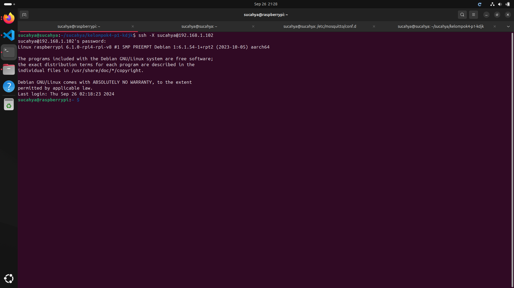</br>

### Menginstal Node.js
Node RED berjalan di atas Node.js. Maka dari itu kita harus menginstal Node.js terlebih dulu
```
sudo apt update
sudo apt install nodejs
node -v
sudo apt install npm
```
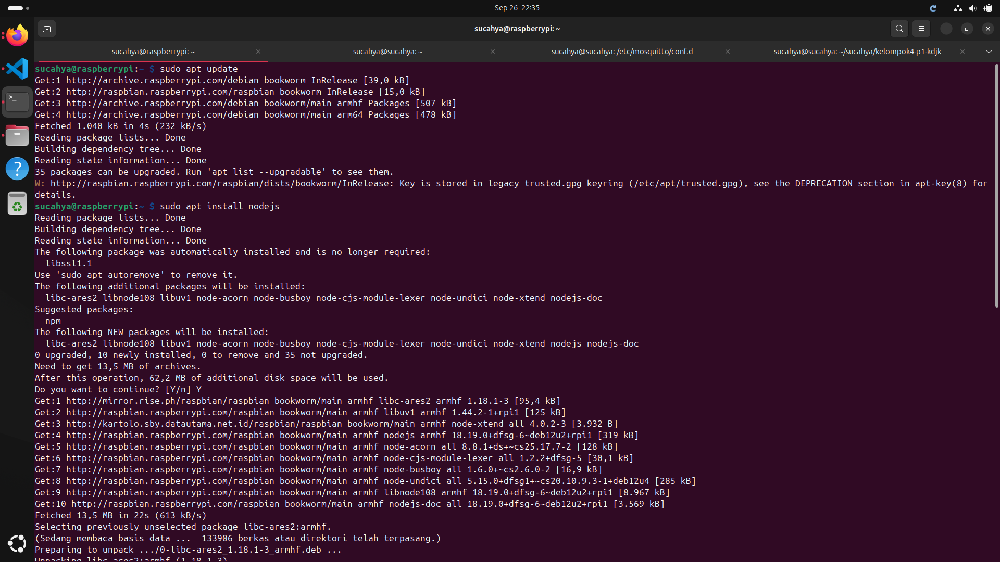</br>
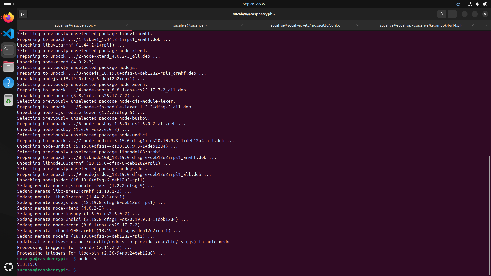</br>
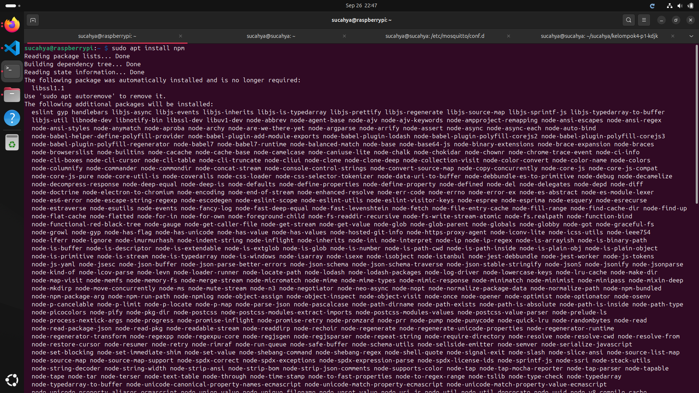</br>

### Menginstal Mosquitto (MQTT Broker)
```
sudo apt update
sudo apt install -y mosquitto
sudo systemctl status mosquitto
sudo apt install -y mosquitto-clients
```
Jika ingin menjalankan atau menutup broker jalankan perintah berikut
```
sudo systemctl start mosquitto
sudo systemctl stop mosquitto
```
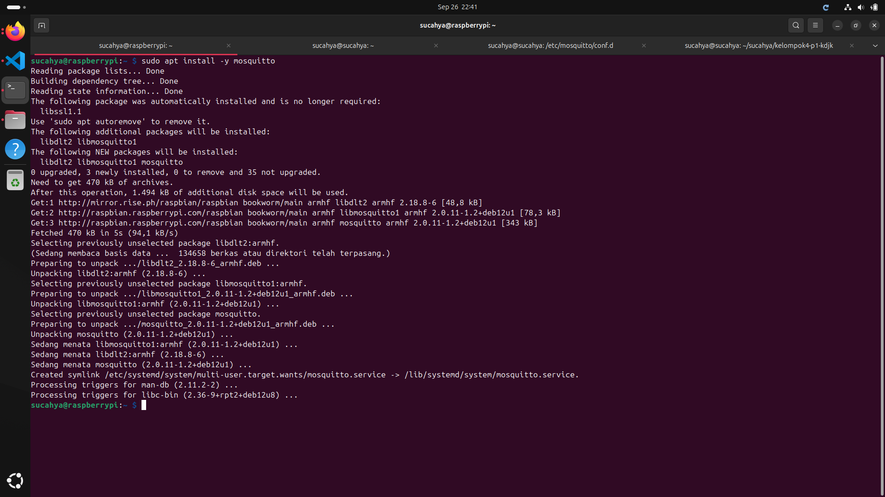</br>
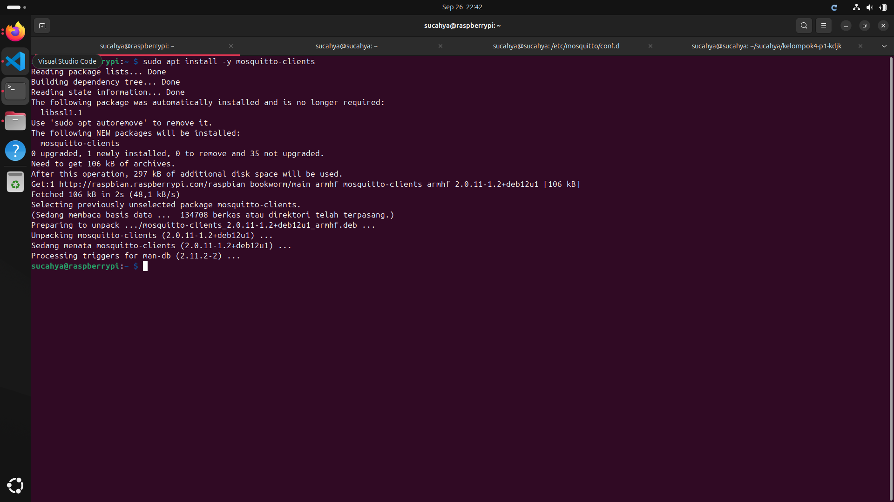</br>

### Menginstall Node RED
```
sudo npm install -g --unsafe-perm node-red
```
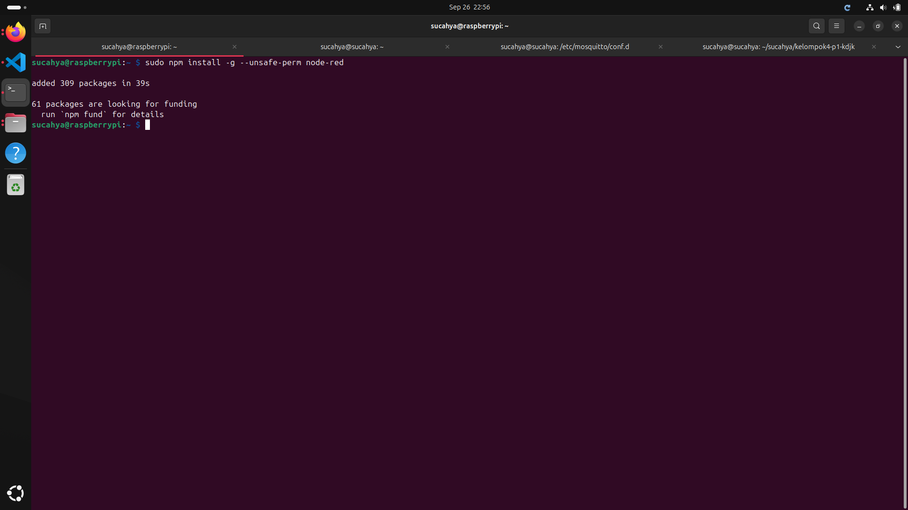

### Setup MQTT ESP32
</details>

# Konfigurasi
<details>

Kita akan menjadikan Raspberry Pi 4 sebagai server. Jadi kita perlu mendaftar dan menginstall localtonet.
### Melakukan registrasi pada localtonet.com
1. Kunjugi website localtonet.com dan isi email untuk registrasi. </br>
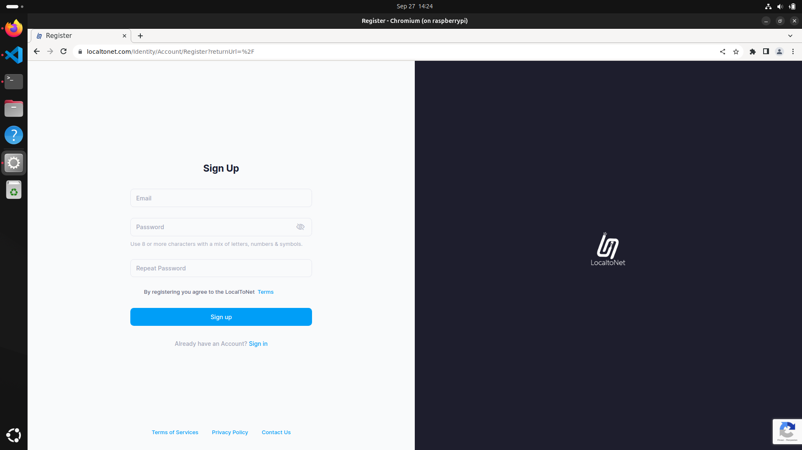</br>
2. Setelah itu copy authtoken yang diberikan secara otomatis</br>
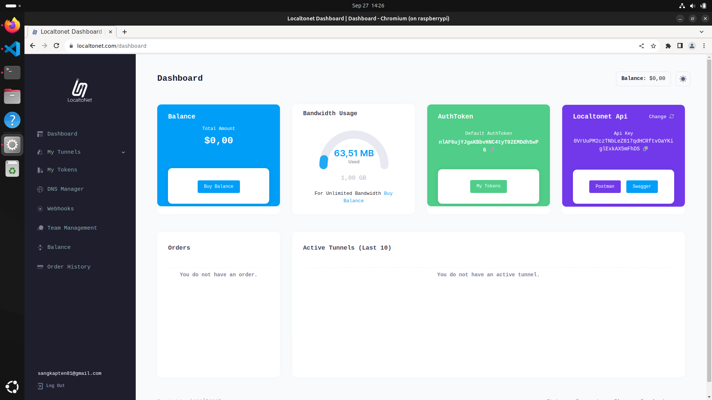</br>
3. Buat server dengan menulis alamat localhost tempat kita menyimpan Node RED (127.0.0.1:1800).
4. Setelah itu jalankan servernya dengan klik tombol start.</br>
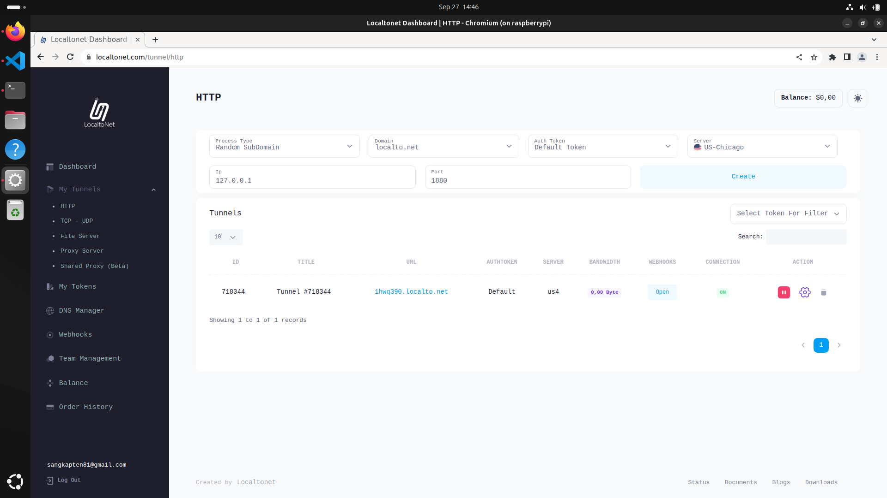</br>
### Menginstal localtonet 
Localtonet berjalan di berbagai maam arsitektur. Raspberry Pi 4 yang saya pakai berjalan dengan arsitektur aarch64 sehingga saya unduh versi yang sesuai.
```
wget https://localtonet.com/download/localtonet-linux-arm.zip
unzip localtonet-linux-arm.zip
chmod 777 ./localtonet
./localtonet authtoken PASTE_HERE_COPIED_AUTHTOKEN 
```
Sehingga muncul tampilan seperti ini</br>
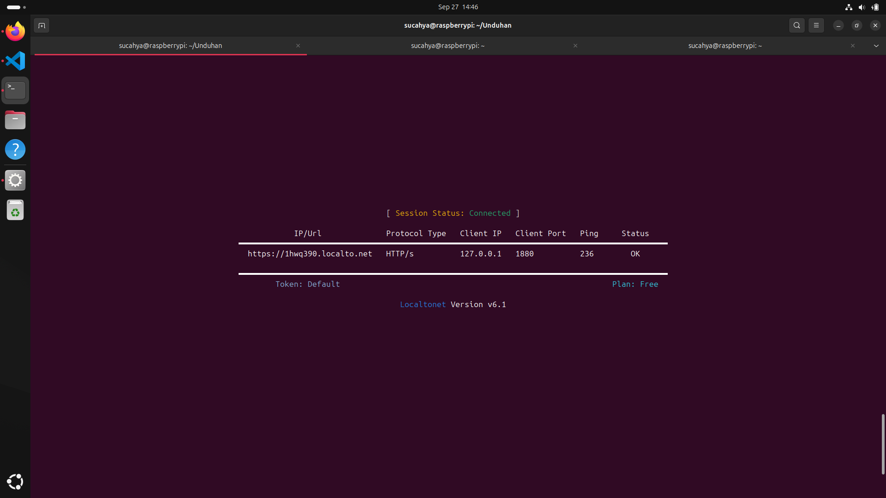</br>
Jangan lupa jalankan Node RED.</br>
Sekarang server sudah berjalan melalui Raspberry Pi 4. Server akan tetap hidup selama Raspberry Pi 4 juga menyala. 
</details>


# Maintenance
<details>
</details>

# Cara Pemakaian
<details>

### Membuka Node RED pertama kali
Memulai Node RED dengan mengetik command di bawah
```
node-red
chromium-browser
```
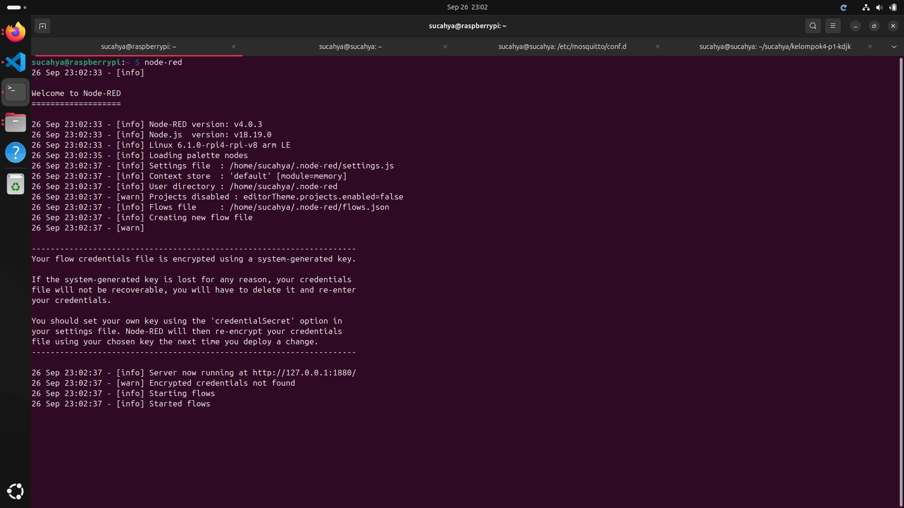</br>

Setelah server Node RED berjalan dan browser terbuka, maka tulis http://127.0.0.1:1880/ pada laman pencarian. Nanti akan muncul tampilan seperti di bawah ini

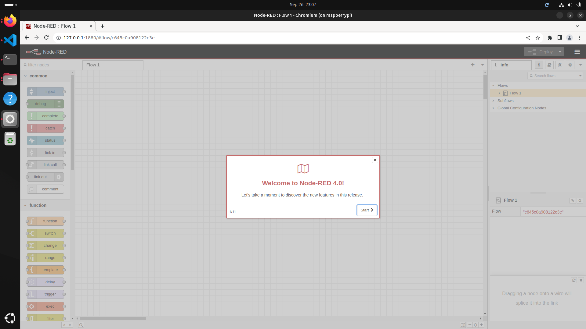</br>
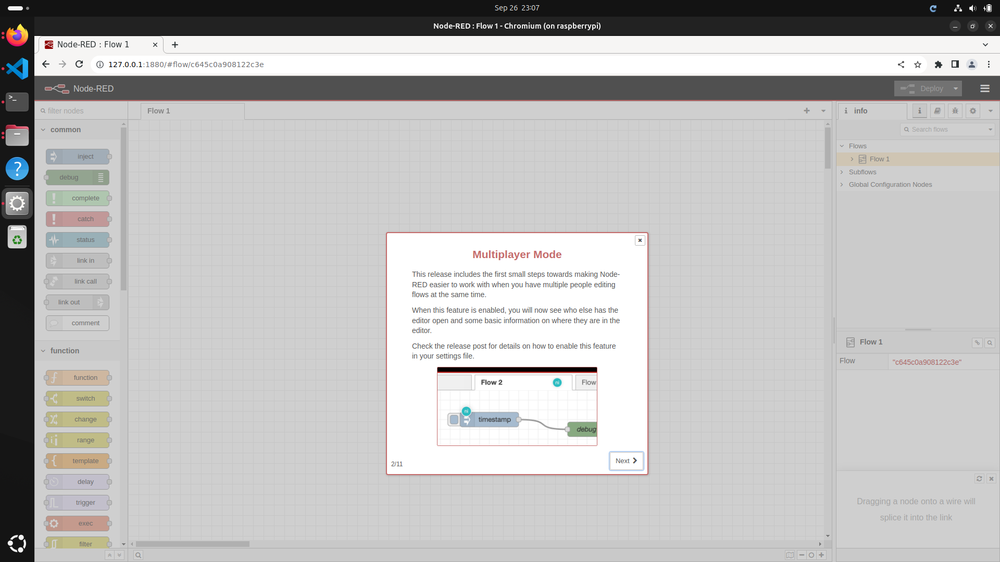</br>

### Pengenalan fitur
1. Node
2. Flow </br>
   - Tab
   - Group
   - Label
3. Configuration
4. Debug
5. Plug-in

### Memulai projek

</details>

# Pembahasan
<details>
   Node-RED adalah platform pemrograman berbasis aliran (flow-based programming) yang ditulis dalam bahasa JavaScript dan berjalan pada runtime Node.js. Berikut adalah kelebihan-kelebihan Node-RED:
- Memiliki antarmuka visual drag-and-drop yang sangat intuitif untuk membuat aliran program
- Mendukung berbagai protokol IoT seperti MQTT, HTTP, WebSocket, dan protokol industri lainnya
- Memiliki dashboard yang mudah dikustomisasi untuk visualisasi data secara real-time
- Tersedia ribuan node tambahan dari komunitas yang dapat diinstall dengan mudah
- Cocok untuk proyek IoT dan automasi karena ringan dan dapat berjalan di perangkat dengan resource terbatas
- Komunitas yang aktif dan dokumentasi yang lengkap
- Dapat diintegrasikan dengan berbagai platform dan layanan cloud
   
Beberapa kekurangan Node-RED antara lain:
- Meskipun antarmuka visual memudahkan pemrograman, tapi bisa membatasi fleksibilitas untuk logic yang sangat kompleks
- Performa bisa menurun ketika menangani aliran data yang sangat besar
- Beberapa node premium atau enterprise tidak tersedia secara gratis
- Membutuhkan pemahaman dasar JavaScript untuk fungsi-fungsi custom

Jika dibandingkan dengan platform serupa seperti Grafana, Node-RED ini memiliki keunggulan dan kelemahannya sendiri. Berikut adalah beberapa perbandingan antara kedua CMS ini:
- Node-RED lebih fokus pada pemrograman aliran dan automasi, sementara Grafana lebih spesialis untuk visualisasi dan monitoring
- Dashboard Node-RED lebih sederhana tapi lebih mudah dikustomisasi, sedangkan Grafana memiliki fitur visualisasi yang jauh lebih kaya
- Node-RED memiliki kemampuan pemrosesan dan transformasi data yang lebih baik
Grafana lebih unggul dalam hal manajemen alert dan notifikasi
- Node-RED lebih ringan dan mudah di-deploy di edge device
Kurva pembelajaran Node-RED lebih landai untuk pemula dibanding Grafana

</details>

# Referensi
<details>
</details>
