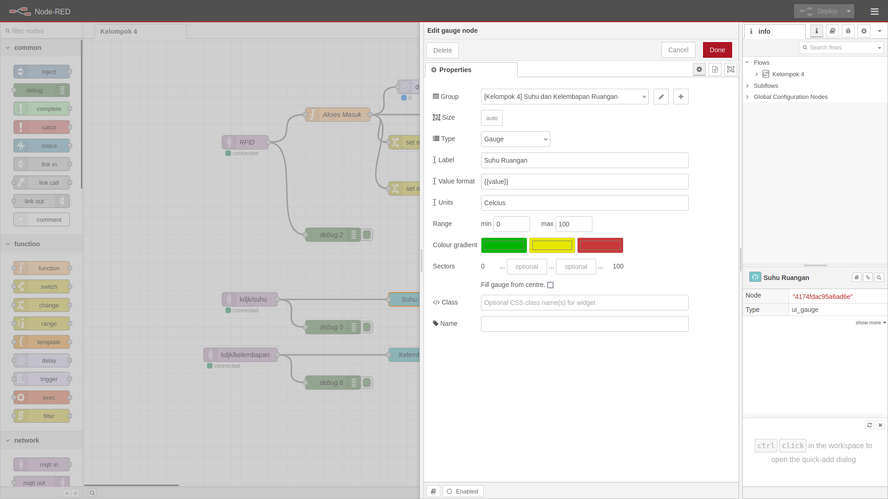

# Kelompok 4 (P1) - Node RED
- [Halaman Node Flow](https://kelompok4.antiribet.cloud) (Link Aplikasi)
- [Halaman User Interface](https://kelompok4.antiribet.cloud/ui) (Link Aplikasi)


# Anggota Tim
| Nama                                      | NIM          | Foto Profil |
|-------------------------------------------|--------------|-------------|
| [I Gusti Ngurah Sucahya Satria Adi Pratama](https://github.com/ngurahsucahya) | G6401221031  |  |
| [Harits Helmi Nabhan](https://github.com/haritsnabhan) | G6401221062  |  |
| [Hamdan Arif Darojat](https://github.com/hmdannarif) | G6401221063  |  |
| [Elrica Meriana Isabel Tutu](https://github.com/ElricaMeriana) | X1004241068 |  |
| [Bima Rizqy Ramadhan](https://github.com/bimaskuy) | G6401221082  |  |


# Sekilas Tentang
<details>
   Node-RED adalah alat pemograman untuk menghubungkan perangkat-perangkat keras, API, dan layanan online dengan cara yang baru dan menarik. Node-RED memberikan editor berbasis browser untuk membuat aplikasi Internet of Things (IoT) yang mana lingkungan pemrograman visualnya mempermudah penggunanya untuk membuat aplikasi sebagai “flow”. Flow ini terbentuk dari node-node yang saling berhubungan di mana tiap node melakukan tugas tertentu. Walaupun Node-RED didesain untuk Internet of Things (IoT), ia juga dapat digunakan untuk keperluan umum dan untuk berbagai macam jenis aplikasi. Node-RED menyediakan editor alur berbasis peramban web, yang dapat digunakan untuk membuat fungsi JavaScript.
</details>

# Instalasi
<details>

### Alat dan Spesifikasi
1. Raspberry Pi 4 Model B
2. Rangkaian RFID menggunakan ESP32 Board seperti pada gambar di bawah</br>

3. Ubuntu 24
4. Raspberry OS 

### Menghubungkan PC dengan Raspberry (SSH)
```
ssh -X sucahya@192.168.1.102
```
</br>

### Menginstal Node.js
Node RED berjalan di atas Node.js. Maka dari itu kita harus menginstal Node.js terlebih dulu
```
sudo apt update
sudo apt install nodejs
node -v
sudo apt install npm
```
</br>
</br>
</br>

### Menginstal Mosquitto (MQTT Broker)
```
sudo apt update
sudo apt install -y mosquitto
sudo systemctl status mosquitto
sudo apt install -y mosquitto-clients
```
Jika ingin menjalankan atau menutup broker jalankan perintah berikut
```
sudo systemctl start mosquitto
sudo systemctl stop mosquitto
```
</br>
</br>

### Menginstall Node RED
```
sudo npm install -g --unsafe-perm node-red
```


### Setup MQTT ESP32
</details>

# Konfigurasi
<details>
   
## Opsi 1

Kita akan menjadikan Raspberry Pi 4 sebagai server. Jadi kita perlu mendaftar dan menginstall localtonet.
### Melakukan registrasi pada localtonet.com
1. Kunjugi website localtonet.com dan isi email untuk registrasi. </br>
</br>
2. Setelah itu copy authtoken yang diberikan secara otomatis</br>
</br>
3. Buat server dengan menulis alamat localhost tempat kita menyimpan Node RED (127.0.0.1:1800).
4. Setelah itu jalankan servernya dengan klik tombol start.</br>
</br>
### Menginstal localtonet 
Localtonet berjalan di berbagai maam arsitektur. Raspberry Pi 4 yang saya pakai berjalan dengan arsitektur aarch64 sehingga saya unduh versi yang sesuai.
```
wget https://localtonet.com/download/localtonet-linux-arm.zip
unzip localtonet-linux-arm.zip
chmod 777 ./localtonet
./localtonet authtoken PASTE_HERE_COPIED_AUTHTOKEN 
```
Sehingga muncul tampilan seperti ini</br>
</br>
Jangan lupa jalankan Node RED.</br>
Sekarang server sudah berjalan melalui Raspberry Pi 4. Server akan tetap hidup selama Raspberry Pi 4 juga menyala. 

## Opsi 2

Kita akan setup vps untuk mengubah security web dari http menjadi https dengan memasang sertifikat ssl.
### Melakukan revese proxy
1. Buat file dengan nama bebas di /etc/nginx/sites-available, kali ini kami menggunakan nama file kelompok4p1.mpkmb.com.
2. Tambahkan kode berikut untuk setup dengan port 1880 pada domain kelompok4p1.mpkmb.com. </br>
```
server {
    listen 80;
    server_name kelompok4p1.mpkmb.com;

    location / {
        proxy_pass http://localhost:1880;
    }
}
```
3. Lakukan command berikut untuk membuat symbolik link sehingga file yang berada di sites-enabled akan mengikut setiap perubahan yang terjadi di sites-available </br>
`sudo ln -s /etc/nginx/sites-available/kelompok4p1.mpkmb.com /etc/nginx/sites-enabled/` </br>
5. Symbolik link dari sites-available ke sites-enabled berhasil dibuat.</br>
 </br>
6. Lakukan command berikut untuk membuat ssl </br>
`sudo certbot --nginx -d kelompok4p1.mpkmb.com` </br>
7. Ketik 2 agar semua request secure </br>
 </br>
8. Ssl sertifikat berhasil dibuat sehingga sekarang web sudah https </br>
 </br>
9. Lakukan command berikut untuk restart nginx </br>
`sudo systemctl reload nginx` </br>
10. Lakukan command `pm2 start packages/node_modules/node-red/red.js` untuk menjalankan program. </br>
 </br>
Sekarang server sudah berjalan melalui VPS. Server akan selalu hidup. 
</details>


# Maintenance
<details>
   
Lakukan command `pm2 list` untuk mendapatkan semua process yang sedang berjalan


Jika salah satu process offline, silahkan restart process tersebut dengan command `pm2 restart {id}` sesuaikan id dengan nama process yang offline


Silahkan cek hal tersebut secara berkala, jika ingin automation restart server secara berkala dengan catatan bahwa server akan shutdown setiap jam silahkan gunakan `cron`
</details>

# Cara Pemakaian
<details>

### Membuka Node RED pertama kali
Memulai Node RED dengan mengetik command di bawah
```
node-red
chromium-browser
```
</br>

Setelah server Node RED berjalan dan browser terbuka, maka tulis http://127.0.0.1:1880/ pada laman pencarian. Nanti akan muncul tampilan seperti di bawah ini

</br>
</br>

### Pengenalan fitur
1. Node </br>
Node merupakan komponen dasar dalam Node-RED. Setiap node dapat dikoneksikan dengan node lain untuk membentuk alur kerja. Contoh node pada aplikasi Node-RED ini yaitu node RFID, node delay, node debug, node template dan lain-lain.
3. Flow </br>
Flow adalah area kerja utama dalam Node-RED yang digunakan untuk menghubungkan node-node sehingga membentuk suatu alur program.
   - Tab: Berfungsi untuk memisahkan flow ke dalam beberapa tab yang berbeda
   - Group: Digunakan untuk mengelompokkan node-node yang saling berkaitan
   - Label: Berfungsi untuk memberikan nama atau keterangan pada komponen
4. Configuration </br>
Untuk mengkonfigurasi nodes dan sistem. Beberapa pengaturan yang dapat dilakukan seperti saat mengatur payload, delay dan koneksi ESP, seperti saat mengatur payload, delay dan koneksi ESP.
6. Debug </br>
Debug adalah fitur yang disediakan untuk memonitor jalannya program, mencari dan memperbaiki kesalahan yang terjadi.
8. Plug-in </br>
Plug-in merupakan fitur ekstensi yang dapat ditambahkan untuk memperluas fungsionalitas Node-RED. Pengguna dapat menginstal berbagai plugin sesuai dengan kebutuhan untuk menambah kemampuan sistem.Ekstensi untuk menambah fungsi tambahan.

### Memulai projek
1. Mengatur koneksi MQTT yang masuk
</br>
2. Mengatur input MQTT yang masuk (Subscribe)
</br>
3. Download plug-in sebagai tampilan user interface
</br>
4. Mengatur tampilan output menggunakan sedikit Javascript
</br>
</br>

</details>

# Pembahasan
<details>
   Node-RED adalah platform pemrograman berbasis aliran (flow-based programming) yang ditulis dalam bahasa JavaScript dan berjalan pada runtime Node.js. Berikut adalah kelebihan-kelebihan Node-RED:
   
- Memiliki antarmuka visual drag-and-drop yang sangat intuitif untuk membuat aliran program
- Mendukung berbagai protokol IoT seperti MQTT, HTTP, WebSocket, dan protokol industri lainnya
- Memiliki dashboard yang mudah dikustomisasi untuk visualisasi data secara real-time
- Tersedia ribuan node tambahan dari komunitas yang dapat diinstall dengan mudah
- Cocok untuk proyek IoT dan automasi karena ringan dan dapat berjalan di perangkat dengan resource terbatas
- Komunitas yang aktif dan dokumentasi yang lengkap
- Dapat diintegrasikan dengan berbagai platform dan layanan cloud
   
Beberapa kekurangan Node-RED antara lain:
- Meskipun antarmuka visual memudahkan pemrograman, tapi bisa membatasi fleksibilitas untuk logic yang sangat kompleks
- Performa bisa menurun ketika menangani aliran data yang sangat besar
- Node-RED merupakan platform open-source yang gratis, namun ketika diintegrasikan dengan layanan infrastruktur komputasi tertentu akan memerlukan biaya berlangganan dari penyedia layanan tersebut. Seingga biaya muncul dari penggunaan layanan pihak ketiga.  Beberapa contohnya:
  - Jika menggunakan node untuk mengakses API dari layanan premium seperti IBM Watson, AWS Lambda, atau Microsoft Azure, maka layanan-layanan ini mungkin memerlukan langganan premium meskipun node di Node-RED gratis.
  - Node yang memanfaatkan layanan cloud seperti Infura atau Alchemy untuk blockchain juga mungkin memerlukan akun premium di layanan tersebut.
- Membutuhkan pemahaman dasar JavaScript untuk fungsi-fungsi custom

Jika dibandingkan dengan platform serupa seperti Grafana, Node-RED ini memiliki keunggulan dan kelemahannya sendiri. Berikut adalah beberapa perbandingan antara kedua CMS ini:
- Node-RED lebih fokus pada pemrograman aliran dan automasi, sementara Grafana lebih spesialis untuk visualisasi dan monitoring
- Dashboard Node-RED lebih sederhana tapi lebih mudah dikustomisasi, sedangkan Grafana memiliki fitur visualisasi yang jauh lebih kaya
- Node-RED memiliki kemampuan pemrosesan dan transformasi data yang lebih baik
Grafana lebih unggul dalam hal manajemen alert dan notifikasi
- Node-RED lebih ringan dan mudah di-deploy di edge device
Kurva pembelajaran Node-RED lebih landai untuk pemula dibanding Grafana

</details>

# Hasil
<details>

## Halaman Node Flow
</br>
## Halaman User Interface
</br>
## Halaman Node Flow (Pengujung Boleh Masuk)
</br>
## Halaman Node Flow (Pengunjung Dilarang Masuk)
</br>
</details>

# Dokumentasi
<details>

</br>
</details>

# Referensi
<details>
</details>
